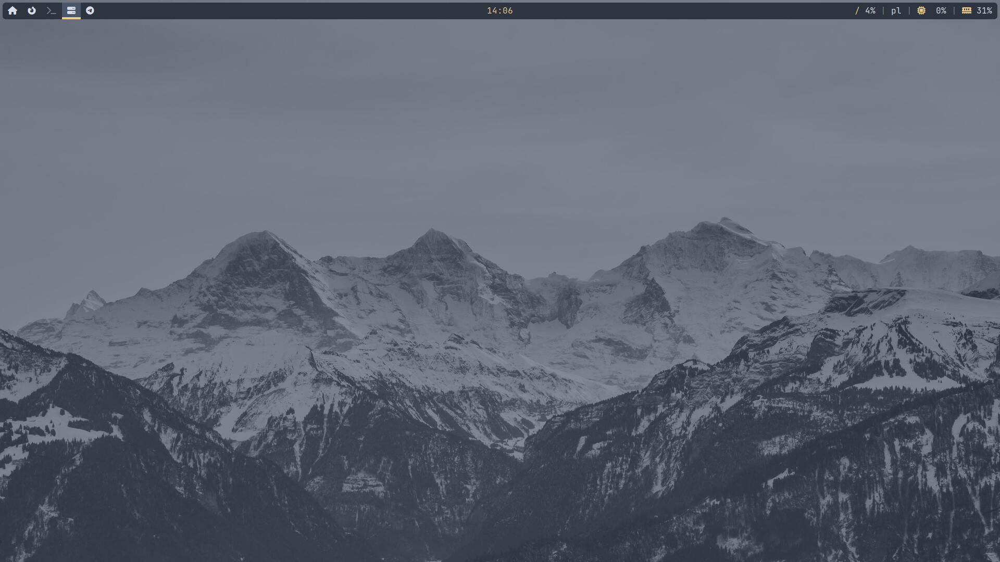

# Dotfiles
These packs are config files (dotfiles) for my Arch Linux.

## Overview
There are currently two packs. They contain a fully configured window manager, a terminal, an application launcher, a sample wallpaper and several other apps.

## Preview

[](https://github.com/Starmaster99/dotfiles/tree/main/dwm-pack)

[](https://github.com/Starmaster99/dotfiles/tree/main/bspwm-pack)

## Installation

Firstly, clone this repo:

```
$ git clone https://github.com/Starmaster99/dotfiles
```

Install needed packages. Simply type `./install-packages.sh`.

Change directory to `dotfiles` folder and move the contents of `.config` repo to *your* `.config` repo:
```
$ cd dotfiles
$ mv .config/* ~/.config/
```

Reboot your PC and now you are good to go!
